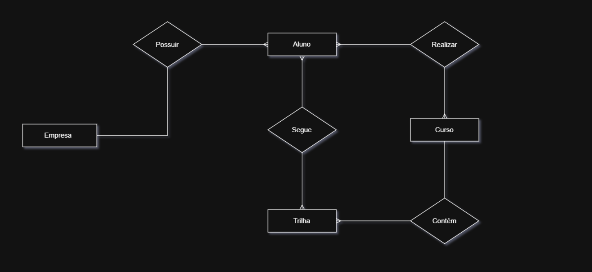

# Requisitos funcionais !
  - Controle de usuários (Login, senha e permissões);
    ADM (Desenvolvedor): acesso total a plataforma
    Superior empresa (Responsável pelo setor): controle de trilhas, dashboard de progressão cursos.
    Funcionário (aluno): acesso as trilhas e progressão de evolução individual.
  - Cadastro de trilhas de cursos do setor;
  - Dashboard de progressão de cursos geral e a nível gerencial e individual.
  - Recomendações de curso com base no histórico de cursos feitos
  - Registro de conclusão.

  ---

# Requisitos não funcionais
  - Controle de acessos criptografados, seguindo as normas da LGPD.
  - Design responsivo e intuitivo.
  - Tempo de resposta compativel.
  - Instruções de uso.

   ---

# Tecnologia
  - Banco de dados:  Postgress.
  - Backend: Python (dashboards e recomendações) / Java (API em geral)
  - FrontEnd: HTML, CSS e JavaScript.
  - FrameWorks: Streamlit (dashboard) / Spring Boot (API).

    ---

    # Design

     ## [Link de acesso](https://www.figma.com/design/5HBY2lOYPd1KlOroduDQ1L/Plataforma-de-cursos--Community-?node-id=1-2&t=2RXf8nIq40ItVyp8-1)


    ---

    # Arquitetura
    
```bash
│
├── frontend/
│   ├── pages/
│   ├── css/
│   ├── js/
│   └── assets/
├── backend/
|   ├── config/
│   ├── controller/
│   ├── service/
│   ├── repository/
│   ├── entity/
│   ├── dto/
│   ├── security
├── data-science/
│   ├── dashboard/
│   ├── recommendation/
│   ├── data/
│   ├── notebooks/
│
└── database/

```

---

# Diagrama de entidades e relacionamentos

<p align="center">
  
</p>

<p align="center">
  
</p>


# Cronograma

| Etapa | Período | Entrega | Principais atividades |
|---|---|---|---|
| **1. Banco de dados e estrutura base** | **25/08 – 31/08** | Banco + estrutura dos projetos | Criar banco MySQL/PostgreSQL, tabelas, relacionamentos, migrations, configurar Spring Boot e estrutura inicial do Frontend/Python |
| **2. Autenticação e usuários** | **01/09 – 07/09** | Login + permissões | Cadastro de usuários, login, Spring Security, JWT, criptografia de senha, perfis ADM/Superior/Funcionário e controle de acesso |
| **3. Cursos e trilhas** | **08/09 – 14/09** | CRUD de cursos e trilhas | Cadastro, edição e exclusão de cursos, categorias e trilhas; associação entre cursos e trilhas; definição da ordem dos cursos |
| **4. Progresso e conclusões** | **15/09 – 21/09** | Controle de evolução | Registro de progresso, início/conclusão de cursos, percentual, notas, certificados e conclusão de trilhas |
| **5. Dashboards** | **22/09 – 28/09** | Dashboard gerencial e individual | Integração Python + API, Streamlit, indicadores, gráficos, progresso geral, por setor e individual |
| **6. Recomendações com ML** | **29/09 – 05/10** | Sistema de recomendações | Preparação dos dados, análise do histórico, criação do modelo de recomendação, integração Python + API e exibição dos cursos recomendados |
| **7. Integração e testes finais** | **06/10 – 12/10** | Sistema completo | Integração Frontend + API + Python, testes, correção de bugs, segurança, responsividade e validação dos requisitos |
| **8. Entrega final** | **13/10 – 19/10** | Projeto finalizado | Testes de aceitação, ajustes finais, preparação para apresentação/deploy e entrega do projeto |
        
      
  
